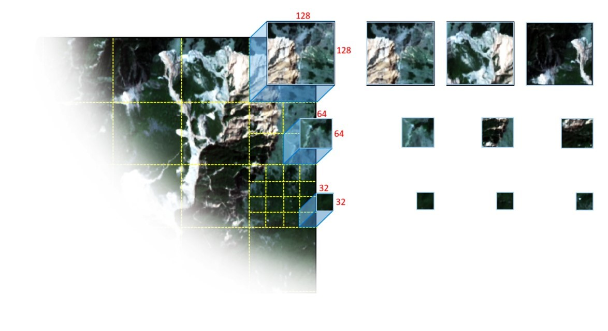

# GeoPatch



**GeoPatch** is a high-performance Python package designed for generating patches from remote sensing satellite imagery. It simplifies the preprocessing pipeline for deep learning tasks by automatically handling large rasters, clipping them into patches, and exporting them alongside corresponding labels for **Semantic Segmentation** and **Object Detection (YOLO format)**.

GeoPatch is built on top of [TerraTiff](https://github.com/Hejarshahabi/TerraTiff) for lightweight, lightning-fast raster operations without the heavy GDAL/rasterio dependencies.

[](https://pypi.org/project/GeoPatch/) [](https://pepy.tech/project/geopatch) [](https://github.com/Hejarshahabi/GeoPatch) [](https://www.linkedin.com/in/hejarshahabi/) [](https://twitter.com/hejarshahabi)

---

## 🛠️ Installation

You can install GeoPatch directly from PyPI:

```bash
pip install GeoPatch
```

---

## 🚀 Tutorial & Usage

GeoPatch makes generating datasets for your computer vision models incredibly simple. It provides two main classes: `TrainPatch` (for generating training datasets) and `PredictionPatch` (for generating inference patches).

### 1. Generating Training Patches (`TrainPatch`)

You can generate datasets for either semantic segmentation or object detection. 

```python
from GeoPatch import TrainPatch

# Define your image and label paths
img_path = "path/to/your/satellite_image.tif"
lbl_path = "path/to/your/label_raster.tif"

# Initialize the patch generator
# patch_size: size of the square patches (e.g., 256x256)
# stride: sliding window step (overlap occurs if stride < patch_size)
patch_generator = TrainPatch(
    image=img_path, 
    label=lbl_path, 
    patch_size=256, 
    stride=128, 
    channel_first=True
)
```

#### Semantic Segmentation Datasets
To generate image patches and their corresponding label masks:

```python
# Generates semantic segmentation patches and saves them as GeoTIFFs
patch_generator.generate_segmentation(
    format="tif",                # Output format: "tif" or "npy"
    folder_name="seg_dataset",   # Output directory
    only_label=False             # Set to True to skip empty background patches
)
```

#### Object Detection Datasets (YOLO Format)
GeoPatch automatically converts your raster labels into YOLO-format bounding boxes `.txt` files.

```python
# Generates image patches and YOLO bounding box text files
patch_generator.generate_detection(
    format="npy",                # Output format: "tif" or "npy"
    folder_name="det_dataset",   # Output directory
    only_label=True,             # Skips patches with no objects
    segmentation=True            # Set to True to also save segmentation masks alongside bboxes
)
```

### 2. Generating Inference Patches (`PredictionPatch`)

When you are ready to predict on a new satellite image, you can use `PredictionPatch` to slice the image into manageable pieces while preserving the geospatial metadata (GeoTransform, CRS) for seamless reconstruction later.

```python
from GeoPatch import PredictionPatch

img_path = "path/to/new_area.tif"

# Initialize prediction patcher
pred_patch = PredictionPatch(
    image=img_path, 
    patch_size=512, 
    stride=512, 
    channel_first=True
)

# Export all patches as GeoTIFFs ready for model inference
pred_patch.save_Geotif(folder_name="inference_patches")
```

---

## 💡 Contact & Contributions

Any feedback from users is welcome! You can write to me at [hejarshahabi@gmail.com](mailto:hejarshahabi@gmail.com) in case of any contribution, bug reports, or suggestions.
